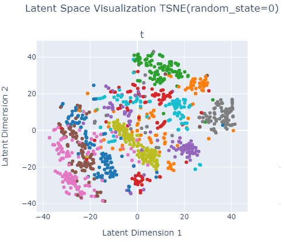
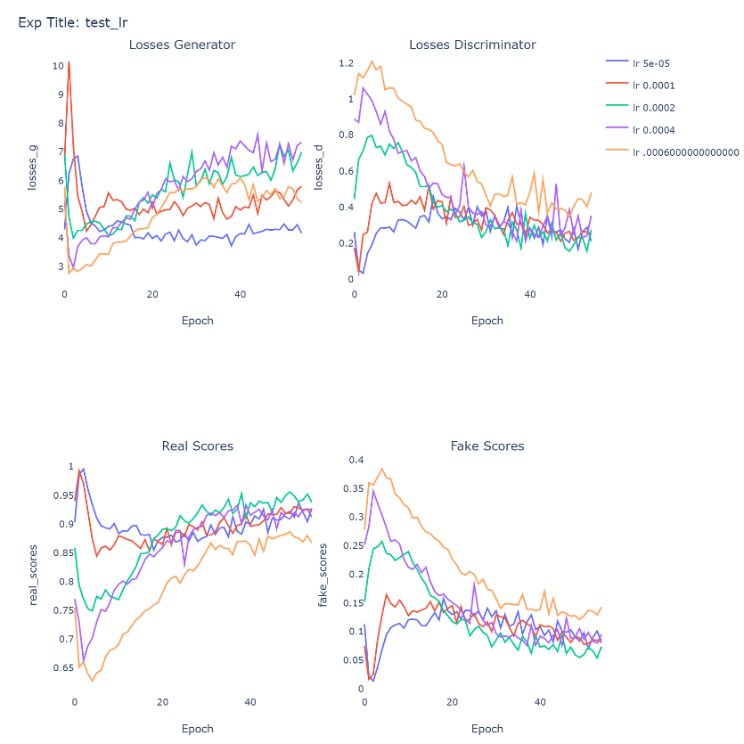
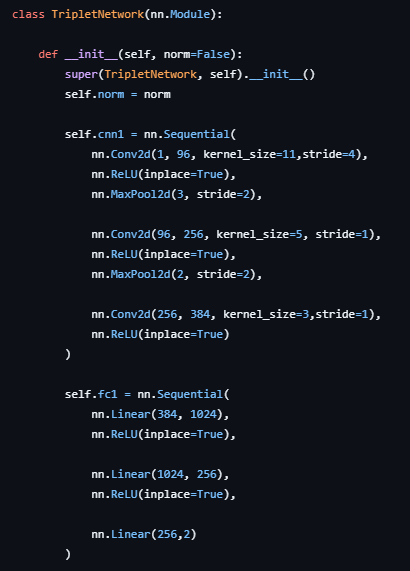
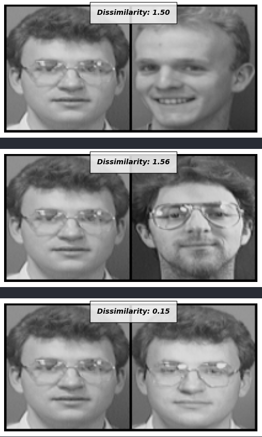

# Deep Learning Models in PyTorch: Implementations and Analysis
This repository is my practical exploration of core deep learning architectures implemented in PyTorch. The aim is to build intuition around:

Model design across different AI tasks

Understanding how various optimizers (e.g., Adam's family, SGD) impact convergence

Choosing effective batch sizes, learning rates, and hidden layer sizes

Evaluating model performance over a range of training epochs

Analyzing loss functions and how they align with task-specific goals

By working through diverse types of deep learning models—including generative, discriminative, and metric learning models—this project also helps clarify the nuances between various learning paradigms: classification, generation, similarity learning, and representation learning.

Each implementation is followed by analysis of the model's training dynamics, convergence behavior, and performance metrics.

* Flow for digit reprezentation learing adn generation- model NICE and various distributions
* GAN for cat image generator - model DCGAN and LSGAN
* Siamese for face simillarity - Siamese model oraz triplet
* Transformer for spam classification - transfer learining with BERT 
* Vae for digit reprezentation learing adn generatio - models AE, VAE and BVAE
